**Halfwave rectifier**:  A Half-wave rectifier is a type of rectifier that only allows one half-cycle of an AC voltage waveform to pass, blocking the other half-cycle. Half-wave rectifiers are used to convert AC voltage to DC voltage. Only one diode is needed to convert AC voltage to DC voltage. 

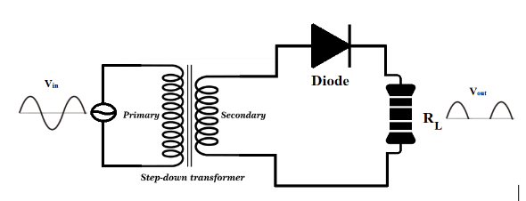

The figure shows the Half-wave rectifier circuit. During the positive half cycle, the diode is forward biased making the current flow through the load resistor. While during the Negative half cycle the diode is reverse biased, so it stops the current flow through the load resistor. For an ideal diode, the output voltage of a half wave rectifier will be 

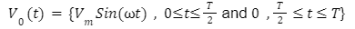

The average output voltage, 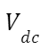  of a half wave rectifier is defined as

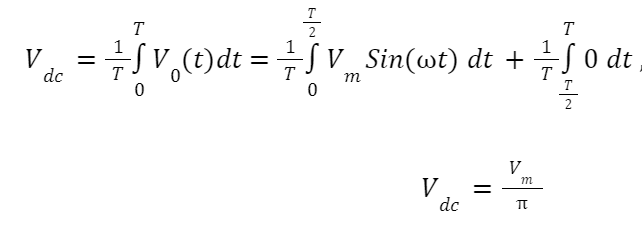 , which on solving we get

To calculate the RMS value of the output voltage, Vrms

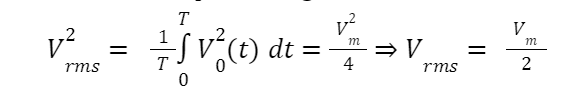

The ripple factor γ of a Half wave rectifier is defined as,

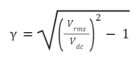

**Full Wave Rectifier**:   
A full wave rectifier converts both halves of each cycle of an alternating wave (AC signal) into pulsating DC signal.

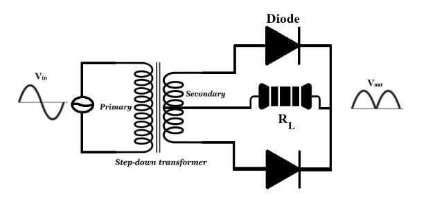

the output voltage of a half wave rectifier will be

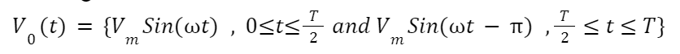

The average output voltage, Vdc of a half wave rectifier is defined as  

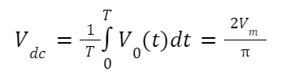

To calculate the RMS value of the output voltage, Vrms  

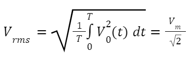  (The rms of ac signal present after rectification)  

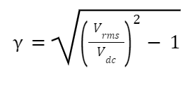

